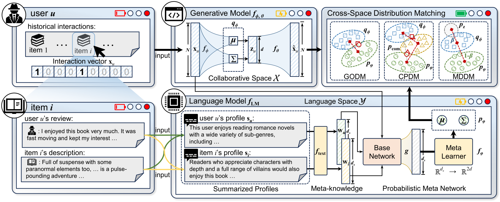

# DMRec

This is an extended PyTorch implementation based on the DMRec framework from the SIGIR 2025 paper:
> Yi Zhang, Yiwen Zhang*, Yu Wang, Tong Chen, and Hongzhi Yin*. 2025. [Towards Distribution Matching between Collaborative and Language Spaces for Generative Recommendation](https://arxiv.org/abs/2504.07363). In Proceedings of the 48th International ACM SIGIR Conference on Research and Development in Information Retrieval (SIGIR’25).

<p align="center">

</p>

## 📝 Environment
```
python == 3.8.18
pytorch == 2.1.0 (cuda:12.1)
scipy == 1.10.1
numpy == 1.24.3
yaml == 0.2.5
```

## 📝 Examples to run the codes
We adopt three widely used recommendation datasets: Amazon-Book, Yelp, and Steam used in previous work.

DMRec now supports a decoupled design: you can select a base model and an alignment strategy separately, then compose them at runtime.
We also keep backward compatibility with the legacy `--model {base}_{strategy}` usage.

### New usage (recommended)
- Base-strategy composition (example with Mult-VAE + MDDM):

  `python train_encoder.py --base_model mult_vae --strategy mddm --dataset {dataset} --cuda 0`

- Other strategies:

  `python train_encoder.py --base_model mult_vae --strategy godm --dataset {dataset} --cuda 0`

  `python train_encoder.py --base_model mult_vae --strategy cpdm --dataset {dataset} --cuda 0`

Note: currently the Mult‑VAE base with MDDM strategy is implemented; GODM/CPDM strategies and CVGA/L‑DiffRec bases are placeholders to be filled.

### Legacy usage (still supported)
We also support the original shortcut by specifying a composed model name:

- Global Optimality for Distribution Matching:

  `python train_encoder.py --model {model_name}_godm --dataset {dataset} --cuda 0`
  
- Composite Prior for Distribution Matching:

  `python train_encoder.py --model {model_name}_cpdm --dataset {dataset} --cuda 0`
  
- Mixing Divergence for Distribution Matching:

  `python train_encoder.py --model {model_name}_mddm --dataset {dataset} --cuda 0`

The hyperparameters of each model are stored in `encoder/config/modelconf`. The most important hyperparameter is the trade-off coefficient `beta`, and the other hyperparameters can be set by default. The `encoder/log` folder provides training logs for reference. The results of a single experiment may differ slightly from those given in the paper because they were run several times and averaged in the experiment.

## 📝 Acknowledgement
To maintain fair comparisons and consistency, the model training framework, the user (item) profiles generated by LLM and their corresponding embedding representations are mainly adapted from the following repo: 
>https://github.com/HKUDS/RLMRec

Many thanks to them for providing the training framework and for the active contribution to the open source community.

This implementation is based on the official DMRec repository: 
>https://github.com/BlueGhostYi/DMRec/tree/main

We appreciate the original authors for their valuable work and open-sourcing the code.

## 📝 Our Extensions
In this implementation, we have made the following extensions to the original DMRec framework:

1. **Decoupled Architecture**: We have refactored the code to support a decoupled design, allowing users to select a base model and an alignment strategy separately, and compose them at runtime. This provides more flexibility in experimentation.

2. **Enhanced CLI Interface**: Added new command-line options (`--base_model` and `--strategy`) to support the decoupled architecture while maintaining backward compatibility with the original `--model {base}_{strategy}` usage.

3. **Modular Implementation**: Improved code modularity to make it easier to add new base models and alignment strategies in the future.

## 📝 Citation
If you find this work is helpful to your research, please consider citing the original paper:
```
@article{zhang2025towards,
  title={Towards Distribution Matching between Collaborative and Language Spaces for Generative Recommendation},
  author={Zhang, Yi and Zhang, Yiwen and Wang, Yu and Chen, Tong and Yin, Hongzhi},
  journal={arXiv preprint arXiv:2504.07363},
  year={2025}
}
```
